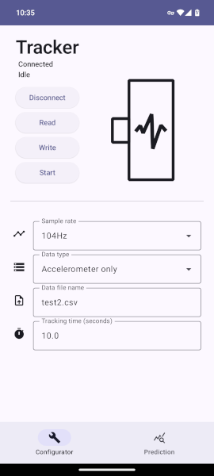
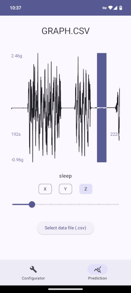
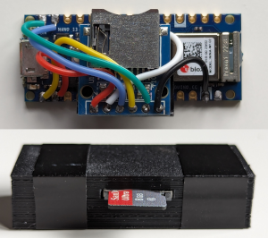
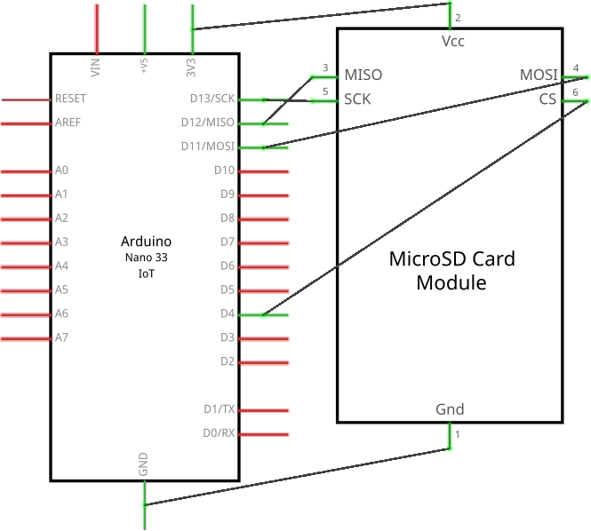

# Low-cost Wearable Movement Data Collection Device

This project consists of code for the firmware of a low-cost wearable movement device and the associated Android app used to configure it. This project was created for a final year Computer Science dissertation project. The write-up for this project is available upon request.

## Images





## Motivation
The motivation for this project was to create a low-cost wearable movement data (accelerometer and gyroscope data) for use in movement disorder research. This project consists of a cost-effective wearable device for collecting movement data, where the important considerations include device cost and the accuracy of the data, such that it can be used as input for a machine learning model. The device is configured wirelessly using an Android companion application. Here, the user is able to configure device settings such as sample rate, tracking time, and type of data collected. Additionally, the app provides the ability to inspect data collected by the device and annotate the data with predicted activities. By demonstrating that data collected from the device can be used with a basic activity prediction model, this shows that the device can be applied to further research into its efficacy in movement disorder research.

## Setup

### Hardware
- Arduino Nano 33 IoT
- SPI micro SD card reader
- Wire (28 AWG is used in the image above) or jumper cables (if headers are soldered to the device)
- Soldering iron (if soldering directly to the Arduino)

Connect the Arduino to the micro SD card reader according to the diagram below, the CS (chip select pin) can be customised in the firmware.



### Software

#### Building and flashing the device firmware
The following instructions detail how to build the firmware using the command line `arduino-cli` tool. However, the process should be similar when using the Arduino IDE.

1. The following Arduino libraries are required to build the device firmware: ArduinoBLE, WifiNINA, SPI and SD. The firmware also requires a modified version of the Arduino_LSM6DS3 library, which allows for a greater configurable sample rate than the stock 104Hz. The library is available in `tracker/lib/Arduino_LSM6DS3`. Libraries can be installed with the following command: `arduino-cli lib install ArduinoBLE WifiNINA SD`. The modified LSM6DS3 needs to be placed in the correct library directory.
2. Install the core for the Arduino Nano 33 IoT: `arduino-cli core install arduino:samd`
3. Clone the repository and, in the `tracker` directory, run: `arduino-cli compile`
4. To flash the firmware, ensure that the default port in `sketch.yaml` matches the port of the connected Arduino. This may have to be changed depending on the machine. When correct, run `arduino-cli upload`.
5. To verify the device is working correctly, ensure a FAT32 formatted micro SD card is inserted and power up the device. Open the companion app and connect to the device. If the app successfully connects, then the device is working correctly.

#### Building and installing the companion app
1. Clone the repository and open `companion` in Android Studio.
2. Android Studio will automatically resolve and download any dependencies. Build the app from Android Studio.
3. Connect an Android device on API 34 (Android 14) or later. If the device shows up in Android Studio, install the app.

## Licence

```
Copyright (C) 2024 Will Spooner

This program is free software: you can redistribute it and/or modify
it under the terms of the GNU General Public License as published by
the Free Software Foundation, either version 3 of the License, or
(at your option) any later version.

This program is distributed in the hope that it will be useful,
but WITHOUT ANY WARRANTY; without even the implied warranty of
MERCHANTABILITY or FITNESS FOR A PARTICULAR PURPOSE.  See the
GNU General Public License for more details.

You should have received a copy of the GNU General Public License
along with this program.  If not, see <https://www.gnu.org/licenses/>.
```
